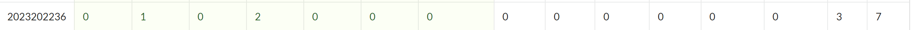
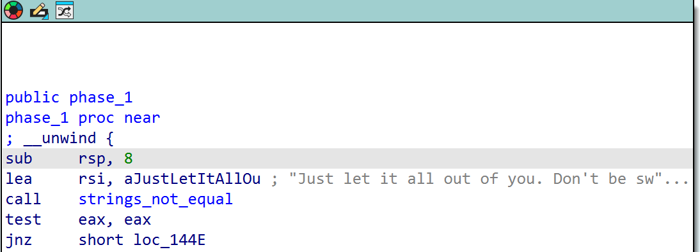

# bomblab 报告

姓名：杨国睿

学号：2023202236

| 总分 | phase_1 | phase_2 | phase_3 | phase_4 | phase_5 | phase_6 | secret_phase |
| --------- | ------------- | ------------- | ------------- | ----------------- |-----------|-----------|-----------|
| 7        | 1            | 1            | 1            | 1 |1  |1  |1  |


scoreboard 截图：



<!-- TODO: 用一个scoreboard的截图，本地图片，放到 imgs 文件夹下，不要用这个 github，pandoc 解析可能有问题 -->

## 解题报告

<!-- 对你拆掉的每个phase进行分析，并写出你得出答案的历程 -->

<!-- 如果能用伪代码还原题目源代码最佳（不属于先前提到的大段代码），语言描述自己的分析也可，每道题目的图片不建议超过两张 -->

### phase_1

```c
// Just let it all out of you. Don't be swayed!
```


IDA反汇编后的代码如图所示，由图可知 `phase_1` 执行的是一个字符串比较函数，只要输入设定的字符串就可以过关。

### phase_2

```c
// 736288 662071 1468350 1425962
```

这道题的计算逻辑如下

```c
for (row = 0; row < 2; row++) {
    for (col = 0; col < 2; col++) {
        sum = 0;
        for (k = 0; k < 3; k++) {
            sum += A[row][k] * B[k][col];
        }
        C[row][col] = sum;
    }
}
```

阅读汇编代码，发现调用 `sscanf` 函数后进行 `cmp $0x4,%eax` 的比较，猜测要求输入四个整数。发现矩阵 `matA` 位于 `0x6140`，且通过 `lea 0x4cab(%rip),%rdi` 加载，矩阵 `matB` 位于 `0x6120`，且通过 `lea 0x4c5e(%rip),%rsi` 加载。代码有三层循环，`imul` 指令表明进行的是矩阵乘法，猜测目标输入为矩阵乘法的结果。用IDA反汇编，在 `.data` 中找到对应矩阵中储存的数据，计算后即可得到目标输入。

### phase_3

```c
// 4 14
```

这道题的逻辑是一个 `switch` 控制流。

```c
switch(index) {
  case 0: ...
  case 1: ...
  ...
  case 7: ...
}
```

IDA反汇编代码，发现程序使用 `sscanf("%d %d")` 读取两个整数 x、y，若读取数量不足两个则直接引爆。然后对第一个整数 x 进行无符号范围检查，要求 `0 ≤ x ≤ 7`，否则引爆。程序通过跳转表实现 `switch(x)`，根据 x 进入对应的 case 分支，在每个分支中计算期望值 `eax = table[x] - delta_1`，其中 `delta_1 = 728`，而 `table` 分别为 `{0x7F, 0x2C3, 0x130, 0x2C4, 0x2E6, 0x26B, 0x194, 0x16C}`。输入的第二个整数 y 需满足非负条件，否则引爆；最终要求 `y == eax` 才能通过。计算后发现，仅当 `x = 4` 时得到 `eax = 742 - 728 = 14`，因此目标输入为 `4 14`。

### phase_4

```c
// 31 BC
```

IDA反汇编代码，发现程序首先通过 `__isoc99_sscanf` 读取输入，格式字符串为 `"%d %2s"`，要求输入一个整数和一个长度不超过 2 的字符串。

随后校验输入的整数。程序固定以参数 `5` 调用递归函数 `func4_1`，并将其返回值与输入的整数进行比较，该函数的递归关系为：当 `n<=1` 时返回 `n`，否则返回 `2*func4_1(n-1)+1`。由此计算得到 `func4_1(5)=31`。

然后程序调用 `func4_2` 在栈上生成一个目标字符串，并将其与输入的字符串进行比较。`func4_2` 使用 `func4_1` 的结果进行多层递归，根据不同分支重排字符。分析后知道当以参数 `(5, 30, 'A', 'C', 'B')` 调用 `func4_2` 时，生成字符串 `"BC"`。最终的目标输入就是 `31 BC`。

### phase_5

```c
// 5>:87;
```

代码逻辑如下

```c
void phase_5(char *s){
  if (strlen(s) != 6) explode_bomb();
  int sum = 0;
  for(int i=0;i<6;i++){
    int idx = s[i] & 0xF;
    sum += array_0[idx];
  }
  if (sum != 57) explode_bomb();
}
```

用IDA反汇编代码，函数首先调用 `string_length` 计算输入字符串长度，并将返回值与 6 比较，也就是说输入字符串长度为 6。

程序进入循环。此时使用 `rax` 作为字符串遍历指针，`rdi` 保存结束地址，`ecx` 作为累加器初始化为 0，`rsi` 指向常量数组 `array_0`。在循环中，程序通过 `movzx edx, byte ptr [rax]` 取出当前字符，再通过 `and edx, 0Fh` 保留字符的低 4 位，得到范围为 0~15 的索引值。随后执行 `add ecx, [rsi+rdx*4]`，将 `array_0` 中对应下标的整数累加到 `ecx` 中。每次循环后指针自增，直至处理完 6 个字符。

循环结束后，程序将累加结果 `ecx` 与常数 `0x39`（57）进行比较，若不相等则引爆炸弹。通过查看 `.rodata` 段可得到数组：`array_0 = [2, 10, 6, 1, 12, 16, 9, 3, 4, 7, 14, 5, 11, 8, 15, 13]`。
所以需要对应元素之和为 57 的 6 个下标，并构造字符使其低 4 位等于这些下标。

### phase_6

```c
// 2 4 5 3 1 6 secret
```

用IDA反汇编代码。程序首先调用 `read_six_numbers` 从输入读取 6 个整数存入栈。随后通过循环对输入进行合法性检查：一是将每个输入减 1 后与常数 5 比较（`sub eax,1; cmp eax,5`），确保所有数字均位于 1~6 范围内；二是通过循环比较已读入的数值，若出现重复则直接调用 `explode_bomb`，因此前六个输入需要是 1~6 的一个排列。

验证通过后，程序以 `.data` 段中的 `node1` 作为链表头结点。对每个输入值 `x`，从 `node1` 开始沿 `next` 指针向后遍历 `x-1` 次，得到对应的第 `x` 个链表节点，并按输入顺序保存这些节点指针。随后代码重新连接这些节点，形成一条新的链表。接着程序依次比较新链表中相邻节点的 `value` 字段（`mov eax,[rax]; cmp [rbx],eax`），若前一节点的值大于后一节点则炸弹爆炸。因此，重排后的链表必须按 `value` 字段升序排列。

根据 `.data` 段中各节点的 `value`（node2 < node4 < node5 < node3 < node1 < node6），可得满足条件的节点顺序为 `2 4 5 3 1 6`。

输入 `secret` 是为了进入最后隐藏的拆弹阶段。

### secret_phase

```c
// 33022
```

用IDA反汇编代码。在 `secret_phase` 中，程序读取一行字符串并检查其长度，通过后以 `(x,y)=(0,0)` 为起点调用 `func7`，只有当其返回非 0 时才能通过该阶段。`func7` 以递归方式逐字符处理输入字符串。每一步取当前字符的低 3 位作为方向（`dir = s[i] & 7`）。

该方向用于索引两组长度为 8 的数组，分别表示“马走日”的落点偏移 `(dx,dy)` 以及对应的“马脚”偏移 `(legx,legy)`。要求落点不能越界、不能落在障碍格，且马走日对应的中间格（马脚）不能为障碍。

当坐标到达目标点 `(4,7)` 时，程序会检查当前字符为字符串结束符 `'\0'`，若不为结束符则仍判定爆炸。

结合 `.data` 段中给出的 `row0~row7` 障碍地图，可得到一条马步序列 `33022`。

## 反馈/收获/感悟/总结

<!-- 这一节，你可以简单描述你在这个 lab 上花费的时间/你认为的难度/你认为不合理的地方/你认为有趣的地方 -->

<!-- 或者是收获/感悟/总结 -->

<!-- 200 字以内，可以不写 -->

## 参考的重要资料

<!-- 有哪些文章/论文/PPT/课本对你的实现有重要启发或者帮助，或者是你直接引用了某个方法 -->
ChatGPT
<!-- 请附上文章标题和可访问的网页路径 -->
